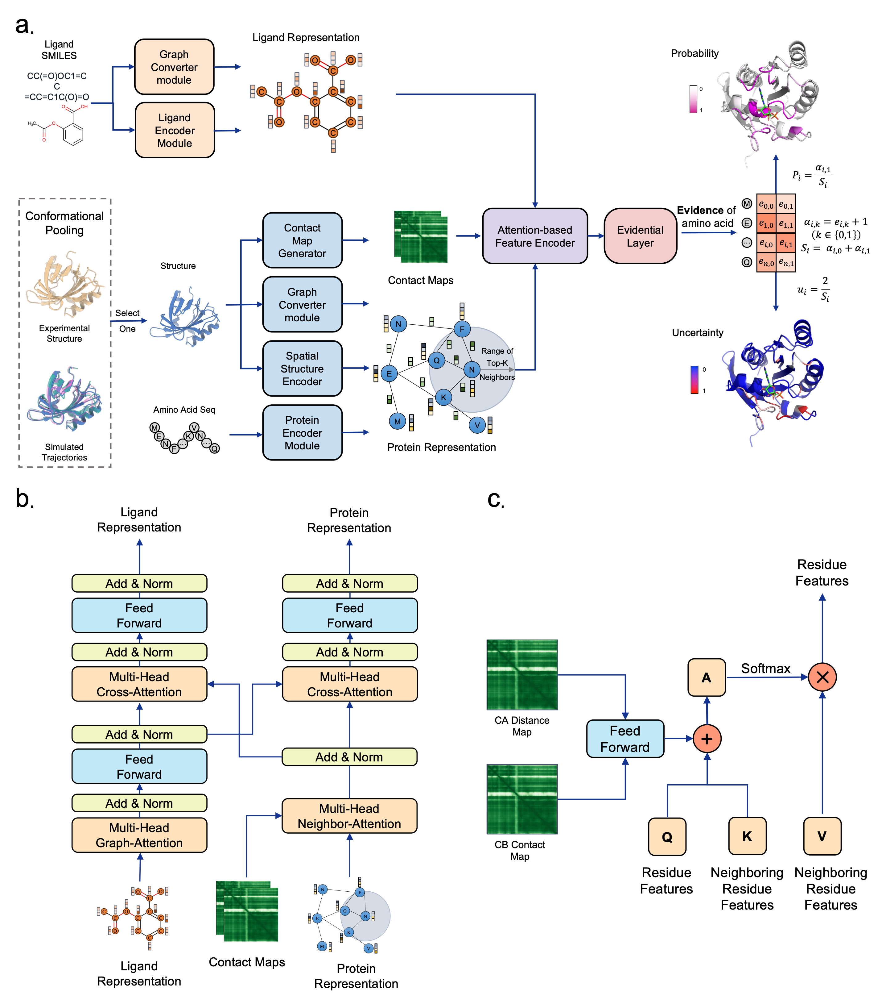

# MDBind
Ligand-specific binding site prediction via molecular dynamics and evidential deep learning

## Introduction
MDBind is a ligand-aware structure-based method to predict the binding sites of proteins for holo, apo and predicted structures.


## Quick Access
To facilitate accessibility for the broader research community and reviewers, we provide two dedicated Google Colab environments.

Standard Inference: This notebook is optimized for structures from the RCSB Protein Data Bank (PDB) and the AlphaFold Protein Structure Database. It enables end-to-end binding site prediction and interactive 3D visualization, and residue-level activation mapping. It can be accessed at: https://colab.research.google.com/github/zhaoqichang/MDBind/blob/main/MDBind.ipynb.

Custom Screening: This notebook is engineered for high-throughput screening and custom structure evaluation. It allows users to upload proprietary .pdb files and perform large-scale ligand screening against a built-in library of approved drugs from DrugBank (version 5.1.17 released on 2026-04-10). It utilizes a max-pooling strategy to identify the most probable interacting ligands for each residue. It can be accessed at: https://colab.research.google.com/github/zhaoqichang/MDBind/blob/main/MDBind_Custom_Screening.ipynb.


## Preparation
Clone this repository by `git clone https://github.com/ljquanlab/MDBind.git` or download the code in ZIP archive.

MDBind is trained and tested on the Linux system, and the system information is as follows:

```sh
$cat /etc/redhat-release
Rocky Linux release 8.7 (Green Obsidian)
$ldd --version
ldd (GNU libc) 2.28
$nvidia-smi
NVIDIA-SMI 580.159.04
Driver Version: 580.159.04
CUDA Version: 13.0
```

MDBind primarily relies on the following Python packages:
- python=3.12.12
- cuda=12.1
- torch=2.4.0+cu121
- biopython=1.86
- transformers=4.39.3
- scikit-learn=1.7.1
- pandas=2.3.3
- numpy=1.26.4
- scipy=1.17.0
- tqdm=4.67.1
- lxml=6.0.2
- periodictable=1.7.0
- accelerate=0.30.1
- rdkit=2025.03.6
- networkx=3.5
- openpyxl=3.1.5
- matplotlib=3.10.8
- seaborn=0.13.2
- unimol_tools

In case you want to use conda for your own installation please create a new MDBind environment.
We showed an example of creating an environment.
```sh
conda create -n mdbind python=3.12.12 -y
conda activate mdbind
pip install torch==2.4.0 torchvision==0.19.0 torchaudio==2.4.0 --index-url https://download.pytorch.org/whl/cu121
conda install biopython=1.86 transformers=4.39.3 scikit-learn=1.7.1 pandas=2.3.3 numpy=1.26.4 scipy=1.17.0 -c conda-forge -y
pip install lxml==6.0.2 periodictable==1.7.0 accelerate==0.30.1 networkx==3.5 openpyxl==3.1.5 unimol_tools rdkit
```

Or you can use the provided [environment.yml](./environment.yml) to create all the required dependency packages.
```sh
conda env create -f environment.yml
```
Similarly, you can build a Docker image to run MDBind. Running via Singularity (Recommended for HPC).
```sh
# Load the Singularity module on your cluster
module load singularity/4.3.1
# Build the SIF image (or build on a local machine with sudo if login node lacks privilege)
sudo singularity build mdbind.sif Singularity.def
# Run the container interactively with GPU support
singularity shell --nv mdbind.sif
```

It is also necessary to install a pre-trained model [Ankh-large](https://huggingface.co/ElnaggarLab/ankh-large). We use the pre-trained weights from HuggingFace for prediction. Please download them to your device. You can also use `python ./scripts/download_weights.py` to download model weights.

Then add permission to execute for DSSP and MSMS by `chmod +x ./tools/mkdssp ./tools/msms`

## Usage

### Feature Generation

#### Ligand
To extract atomic representations for ligands using UniMol, run the `./scripts/get_ligand_features.py` script. This script reads SMILES strings from the input file, processes them via unimol_tools, aligns the atom order with RDKit, and saves the extracted features as a .pkl file.

1. **Prepare your input data**: Ensure your SMILES file (e.g., `ligand_smiles.txt`) is located in the target directory, formatted with one ligand per line (`<ligand_name> <smiles>`):
   ```text
   EG2 [H]c1c([H])c(S(=O)...
   Y27 [H]c1nc([H])c([H])...
   ```
2. **Run the feature extraction script**:
```bash
cd scripts/
python get_ligand_features.py \
    --smiles_file ./../datasets/PDBbind/ligand_smiles.txt \
    --out_path ./../datasets/PDBbind/Features/ligand_atoms.pkl
```

#### Protein
To extract amino acid representations for proteins using Ankh, DSSP and MSMS, run the `./scripts/get_protein_features.py` script. This script reads `pdb` files and saves the extracted features as a `.npy` file.

1. **(Optional)Run the weight download script**:
```bash
cd scripts/
python ./download_weights.py
```

2. **Changing the mode of  DSSP and MSMS**:
```bash
chmod +x ./tools/mkdssp ./tools/msms
```

3. **Run the feature extraction script**:
```bash
cd scripts/
python get_protein_features.py
```

### Validation on the CrypticPocket dataset
We have provided a detailed workflow to reproduce the results on the CrypticPocket dataset using trained models based on the PDBbind dataset. 
```bash
python prediction_CrypticPocket.py
```

### Retrain
We have provided a detailed workflow to reproduce the results presented in the paper, using training and validation based on PDBbind as an illustrative example. 
```bash
python train.py
```

## Contacts
Any more questions, please do not hesitate to contact us: qczhao94@hku.hk.

## License
This project is licensed under the terms of the MIT license. See [LICENSE](./LICENSE) for additional details.
